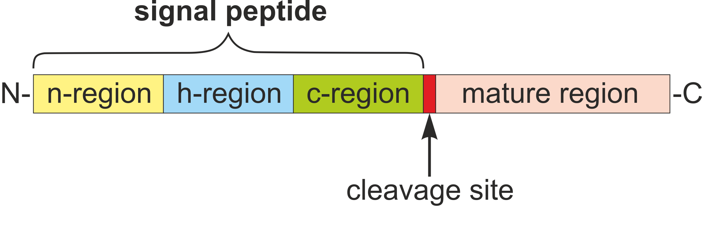
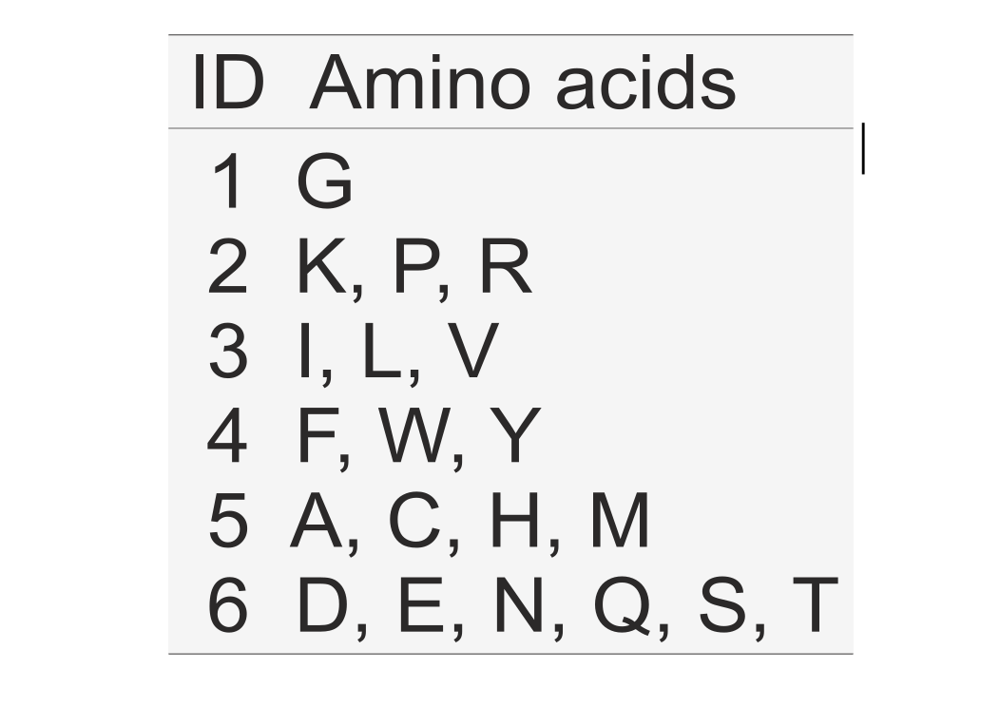
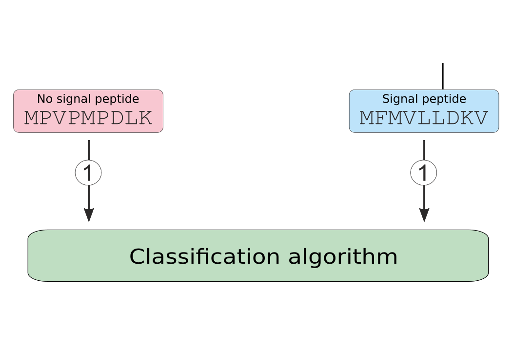
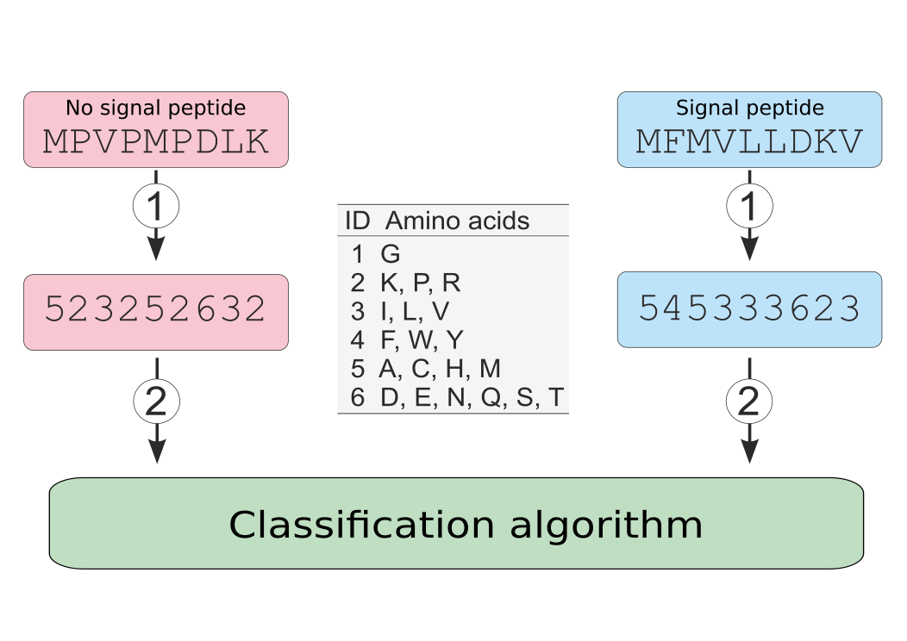

---
output:
  revealjs::revealjs_presentation:
    self_contained: false
    incremental: true
    css: report.css
    reveal_plugins: ["zoom"]
bibliography: presentation.bib
---

## 

<h1>Alphabet reduction in signal peptide prediction</h1>

<h2>Michał Burdukiewicz<h2>

<h3>University of Wrocław<h3>

<h3>30-01-2017<h3>

# Alphabet reduction

```{r echo=FALSE}
source("my_ggplot_theme.R")

g_legend<-function(a.gplot){
  tmp <- ggplot_gtable(ggplot_build(a.gplot))
  leg <- which(sapply(tmp$grobs, function(x) x$name) == "guide-box")
  legend <- tmp$grobs[[leg]]
  return(legend)}

library(dplyr)
library(reshape2)
library(xtable)
library(biogram)
library(ggbeeswarm)
library(plotly)
library(factoextra)

load("./dat/signalhsmm_poster.RData")

freq_nondeg <- read.csv2("./dat/freq_nondeg.csv")[, -1]
freq_deg <- read.csv2("./dat/freq_deg.csv")[, -1]

do_pca <- function(x) 
  x %>% 
  select(-type, -taxon) %>% 
  prcomp(center = TRUE, scale = TRUE) %>% 
  getElement("x") %>% 
  data.frame() %>% 
  select(1, 2) %>% 
  cbind(select(x, type, taxon), .) %>% 
  mutate(type_nice = factor(type, labels = c("Mature peptide", "Signal peptide")),
         taxon_nice = factor(taxon, labels = c("other eukaryotes", "Plasmodium"))) %>% 
  mutate(both = paste0(type_nice, "\n(", taxon_nice, ")\n")) %>% 
  filter(type_nice == "Signal peptide")

dat_deg <- do_pca(freq_deg) 
dat_nondeg <- do_pca(freq_nondeg)

# dat_deg <- read.table("PCAgr.txt", header = TRUE, sep = "\t")
# dat_nondeg <- read.table("PCA.txt", header = TRUE, sep = "\t")
# colnames(dat_deg) <- c("both", "PC1", "PC2")
# colnames(dat_nondeg) <- c("both", "PC1", "PC2")

plot_pca <- function(x)
  ggplot(x, aes(x = PC1, y = PC2, fill = both)) + 
  geom_density_2d(color = "black", contour = TRUE) +
  #geom_point() +
  stat_density2d(aes(fill=both,alpha=..level..), color = "black", contour = TRUE, geom="polygon") +
  scale_linetype_discrete("") +
  scale_fill_manual("", values = c("dodgerblue1", "firebrick1"), 
                    labels = c("Other eukaryotes", "Plasmodiidae")) +
  scale_shape_discrete("") +
  scale_color_discrete("") +
  scale_x_continuous("Principal Component 1\n") +
  scale_y_continuous("Principal Component 2") +
  scale_alpha_continuous(range = c(0.25, 0.4)) +
  guides(alpha = FALSE, fill = guide_legend(nrow = 1)) +
  my_theme

p1 <- plot_pca(dat_nondeg) 
p2 <- plot_pca(dat_deg)
leg <- g_legend(p1)
```

## Amino acid encoding

- For machine learning algorithms amino acids are usually described as vectors of 20 bits (e.g., alanine is 1000000000000000).
- The distance between very similar amino acids (as D and E) is the same as a distance between two very different amino acids (as D and W).


## Signal peptide structure

<div id="left">



</div>

<div id="right">

- The regional structure of signal peptide does not rely on specific residues, but rather on their physicochemical properties.
- The only (partial) exception is the cleavage site (the first cleavage site predictor used a reduced amino acid alphabet [@von_heijne_patterns_1983]). 

</div>

## Aim

<div id="left">



</div>

<div id="right">

- The reduction of amino acid alphabet is an equivalent of an assignment of amino acid aggregates to larger groups based on chosen properties.

</div>

## Aim

<div id="left">


</div>

<div id="right">

- Remove unnecessary information.
- Decrease number of sequences required to train a signal prediction algorithm.
- Create more universal decision rules.

</div>

## Universality

<div id="left">

```{r echo=FALSE,fig.width=4}
p1 + ggtitle("PCA of the signal peptide\namino acid composition")
```


</div>

<div id="right">

- Organisms may undergo a global shift in a proteome composition [@brbic_global_2015].
- Their signal peptides must still have physicochemical properties required for the proper recognition.

</div>

# Implement reduced alphabet

## Orthogonality

- Feature encoding is orthogonal towards the classification methods.

## Orthogonality



## Orthogonality



## Comparison of algorithms

- The classification algorithm incorporating a reduced amino acid alphabet should always be compared with its equivalent trained on sequences described in the full alphabet. 
- The tuning of parameters should be done separately for classifier involving a reduced amino acid alphabet.


# Generation of reduced alphabets

## Previous research

- Prediction of signal peptides was done before and it does not provide any edge over the full alphabet [@maetschke_blomap:_2005].
- We need reduced alphabets tailored for the signal prediction problem.

## Source of reduced alphabets


## Properties of amino acids

```{r echo=FALSE, fig.height=5}

# Hydrophobicity index (Argos et al., 1982)
# Net charge (Klein et al., 1984)

prop_dat <- data.frame(hydroph = aaprop["ARGP820101", ], 
                       charge = aaprop["KLEP840101", ],
                       hydroph2 = aaprop["KYTJ820101", ],
                       aa = toupper(colnames(aaprop))
)

ggplotly(ggplot(prop_dat, aes(y = hydroph, x = charge, label = aa)) +
  geom_quasirandom(size = 5, width = 0.1) +
  scale_y_continuous("Hydrophobicity (Argos et al., 1982)\n") +
  scale_x_continuous("Net charge (Klein et al., 1984)") +
  my_theme)
```

All scale were normalized 0-1. Points are jittered over net charge.

## Properties of amino acids

```{r echo=FALSE, fig.height=5}
cl <- hclust(d = dist(prop_dat[, 1L:2]))
cl2 <- hclust(d = dist(prop_dat[, 2L:3]))

prop_dat2 <- data.frame(prop_dat,
                        gr1 = factor(cutree(cl, k = 3)),
                        gr2 = factor(cutree(cl2, k = 3)),
                        gr3 = factor(cutree(cl, k = 4))
)

ggplotly(ggplot(prop_dat2, aes(y = hydroph, x = charge, label = aa, color = gr1)) +
  geom_quasirandom(size = 5, width = 0.1) +
  scale_y_continuous("Hydrophobicity (Argos et al., 1982)\n") +
  scale_x_continuous("Net charge (Klein et al., 1984)") +
  my_theme)
```

All scale were normalized 0-1. Points are jittered over net charge.

## How large alphabet?

```{r echo=FALSE, fig.height=5}
ggplotly(ggplot(prop_dat2, aes(y = hydroph, x = charge, label = aa, color = gr3)) +
  geom_quasirandom(size = 5, width = 0.1) +
  scale_y_continuous("Hydrophobicity (Argos et al., 1982)\n") +
  scale_x_continuous("Net charge (Klein et al., 1984)") +
  my_theme)
```

All scale were normalized 0-1. Points are jittered over net charge.

## Which properties?

```{r echo=FALSE, fig.height=5}

ggplotly(ggplot(prop_dat2, aes(y = hydroph2, x = charge, label = aa, color = gr2)) +
  geom_quasirandom(size = 5, width = 0.1) +
  scale_y_continuous("Hydropathy index (Kyte-Doolittle, 1982)\n") +
  scale_x_continuous("Net charge (Klein et al., 1984)") +
  my_theme)
```

All scale were normalized 0-1. Points are jittered over net charge.


# Results

## Our model

- We build a signal peptide predictor (based on hidden semi-Markov models) separately for each of 96 reduced alphabets.
- We chose the best-performing reduced amino acid alphabet in cross-validation experiment using only non-\textit{Plasmodiidae} eukaryotic sequences.
- The resulting predictor in the benchmark had the best AUC not only for signal peptides of other eukaryotes, but also for \textit{Plasmodiidae} signal peptides.

## Performance

|                                                                      | MCC             | AUC             |
|---------------------------------------------------------------------:|-----------------|-----------------|
|                    signalP 4.1 (no tm) \citep{petersen_signalp_2011} | 0.6872          | 0.8667          |
|  \rowcolor[gray]{0.85}signalP 4.1 (tm) \citep{petersen_signalp_2011} | 0.6196          | 0.7951          |
|                       signalP 3.0 (NN) \citep{DyrlovBendtsen2004783} | 0.7220          | 0.8938          |
| \rowcolor[gray]{0.85}signalP 3.0 (HMM) \citep{DyrlovBendtsen2004783} | 0.5553          | 0.7734          |
|                                 PrediSi \citep{hiller_predisi:_2004} | 0.3849          | 0.6453          |
|     \rowcolor[gray]{0.85}Philius \citep{reynolds_transmembrane_2008} | 0.5684          | 0.7707          |
|                                   Phobius \citep{kall_combined_2004} | 0.5895          | 0.7880          |
|                                 \rowcolor[gray]{0.85}signalHsmm-2010 | 0.7409          | 0.9262          |
|                                          signalHsmm-2010 (hom. 50\%) | **0.7621**          | **0.9384** |
|                        \rowcolor[gray]{0.85}signalHsmm-2010 (raw aa) | 0.6853          | 0.8718          |
|                                                      signalHsmm-1987 | 0.7271          | 0.9063          |
|                     \rowcolor[gray]{0.85}signalHsmm-1987 (hom. 50\%) | 0.7194          | 0.9090          |
|                                             signalHsmm-1987 (raw aa) | 0.6350          | 0.8350          |

Benchmark data set: \textit{Plasmodiidae} proteins from UniProt data base (51 proteins with signal peptide and 211 proteins without signal peptide).


## Best-performing reduced amino acid alphabet

Group                      Amino acids
-------------------------- ---------------------
I                          D, E, H, K, N, Q, R
\rowcolor[gray]{0.85}II    G, P, S, T, Y
III                        F, I, L, M, V, W
\rowcolor[gray]{0.85} IV   A, C

## PCA of amino acid composition

```{r echo=FALSE}
grid.arrange(textGrob("", x = 0.75, y = 0.9, gp=gpar(fontsize=32)), 
             p1 + guides(fill = FALSE) + ggtitle("Full alphabet"), 
             textGrob("", x = 0.75, y = 0.9, gp=gpar(fontsize=32)),
             p2 + guides(fill = FALSE) + ggtitle("Reduced alphabet") , 
             rectGrob(x = unit(0.5, "npc"), y = unit(0.5, "npc"), gp = gpar(col = "white")), leg, 
             nrow = 3, heights = c(0.48, 0.48, 0.04), widths = c(0.04, 0.96))
```


# Summary

## Challenges

- How to choose **smartly** the most optimal reduced amino acid alphabet?
- How to reduce the homology of the training data set? Should one reduce the homology using sequences described in the full or a reduced amino acid alphabet?

## Proposed framework

- Define which categories of physicochemical properties should be used to generate reduced amino acid alphabets.
- Remove too colinear properties.
- Define the minimum and maximum length of reduced amino acid alphabets.
- Create reduced amino acid alphabets.
- Choose non-redundant amino acid alphabets.
- Perform cross-validation comparing reduced amino acid alphabets.

## References