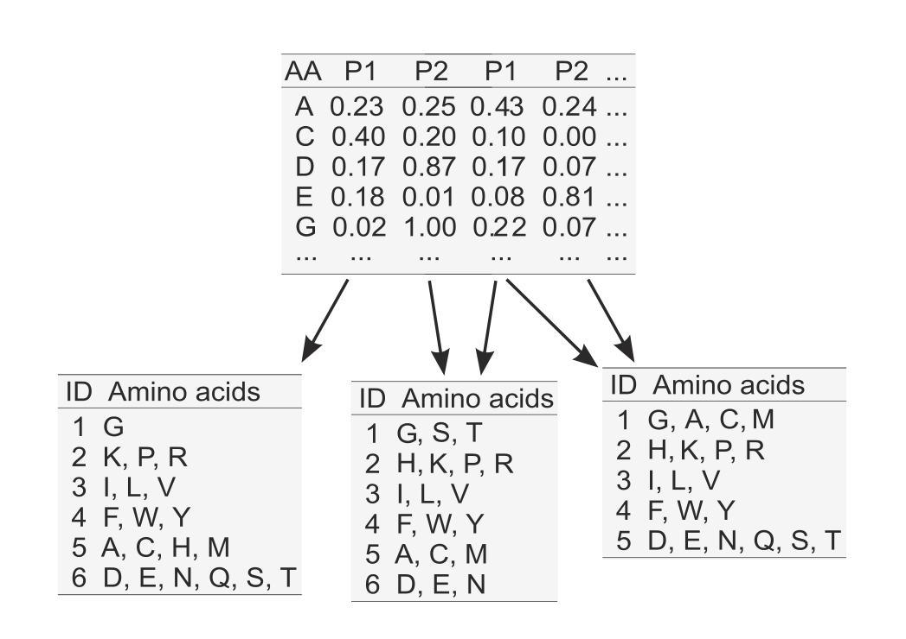

---
output:
  revealjs::revealjs_presentation:
    self_contained: false
    incremental: true
    reveal_plugins: ["zoom"]
---

## 

<h1>Alphabet reduction in signal peptide prediction</h1>

<h2>Michal Burdukiewicz<h2>

<h3>25 stycznia 2017<h3>

# Alphabet reduction

```{r echo=FALSE}
library(knitr)
opts_chunk$set(tidy.opts=list(width.cutoff = 50), tidy=TRUE)
```

## Aim

Blabla


# Feature encoding

## Orthogonal encoding of amino acids


# Generation of reduced alphabets

## Source of reduced alphabets


